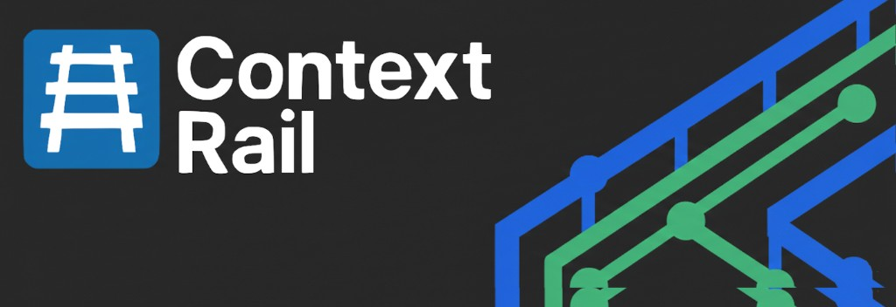

# Radar

> Your AI agent's company clerk. Hands off the legwork so the thinking stays sharp.

[](https://contextrail.app/)

Radar is a delegation worker for AI coding agents. It lets a high-reasoning host model hand off mechanical I/O work to a cheaper OpenAI-compatible worker model: bulk file reading, codebase search, long-output summarization, and boilerplate drafting.

Radar is built by [ContextRail](https://contextrail.app/), the standards layer for AI-ready teams.

The rule is simple:

> The host agent thinks. Radar handles the paperwork.

## Quick Start

Requires Node.js 20 or newer.

```bash
pnpm install -g @contextrail/radar
export RADAR_API_KEY=sk-...
radar ask -p package.json README.md -q "What is this package for?"
```

## Tools

| Tool        | Use it when...                                        |
| ----------- | ----------------------------------------------------- |
| `ask`       | You know which files should be read                   |
| `search`    | You need to find relevant files before reading        |
| `summarize` | You have a long log, transcript, diff, or test output |
| `write`     | You need a draft that matches an existing pattern     |

Radar runs as both:

- an MCP server with `radar-mcp`
- a CLI with `radar`

## Documentation

The full docs live in [`docs/`](./docs/index.md):

- [Getting Started](./docs/getting-started.md)
- [Delegation Model](./docs/delegation-model.md)
- [Configuration](./docs/configuration.md)
- [MCP Clients](./docs/mcp-clients.md)
- [CLI Reference](./docs/cli-reference.md)
- [Documentation Updates Recipe](./docs/recipes/documentation-updates.md)

## Agent Routing Rules

Installing Radar does not automatically modify a consuming project. Copy the routing guidance into the project where your AI agent works:

- `AGENTS.md` for general agent instructions.
- `.cursor/rules/radar-delegation.mdc` for Cursor.
- `CLAUDE.md` for Claude Code.

Use Radar for paperwork. Keep debugging, architecture, security judgment, safety-critical work, and exact edits with the host agent.

## Development

```bash
git clone https://github.com/contextrail/radar
cd radar
pnpm install
pnpm run check
pnpm run build
pnpm run docs:dev
```

## Release

Releases are automated with semantic-release. Use Conventional Commits, merge to `main`, and the release workflow publishes to npm and creates a GitHub Release.

## License

MIT
