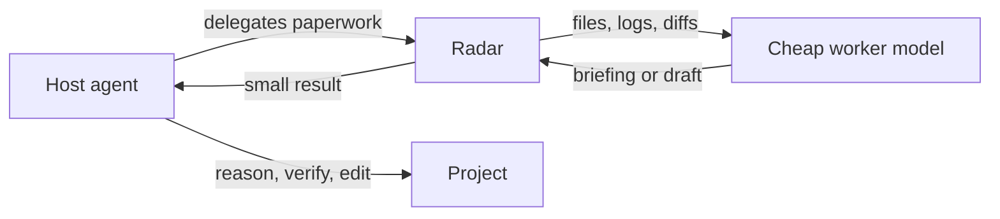

# Radar

Radar is a delegation worker for AI coding agents. It lets a high-reasoning host model hand off mechanical work to a cheaper OpenAI-compatible worker model.

Radar is built by [ContextRail](https://contextrail.app/), the standards layer for AI-ready teams.

The rule is simple:

> The host agent thinks. Radar handles the paperwork.

Use Radar for bulk file reading, code search, long-output summarization, and boilerplate drafts. Keep debugging, architecture, security judgment, safety-critical decisions, and exact edits with the host agent.

## Start Here

- [Getting Started](./getting-started.md): install Radar, configure a model, and run the first task.
- [Delegation Model](./delegation-model.md): understand when to delegate and when to keep work with the host agent.
- [MCP Clients](./mcp-clients.md): connect Radar to Cursor, Claude Code, Codex, and other MCP clients.
- [CLI Reference](./cli-reference.md): look up commands and flags.

## Core Workflows

- [Documentation updates](./recipes/documentation-updates.md)
- [Bulk code reading](./recipes/bulk-code-reading.md)
- [Search before reading](./recipes/search-before-reading.md)
- [Boilerplate generation](./recipes/boilerplate-generation.md)
- [Long log summarization](./recipes/long-log-summarization.md)

## How It Works

Radar packages selected files or content into a stable corpus, sends that corpus to the worker model before the question, and returns a short briefing to the host agent. That preserves the host model's context for judgment and edits.

